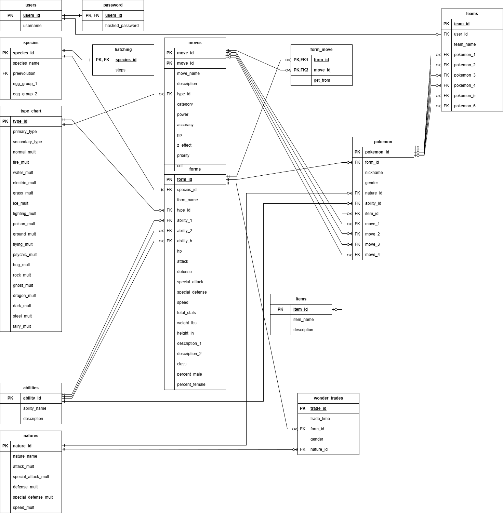

# Pokémon Soluna
### Team Members: Kyle Chiasson, Will Krietemeyer, Luke Welday
## Goal
&emsp;Pokémon Soluna will act as a Pokémon Sun and Moon companion app. It will provide detailed information on all the Pokémon, moves, and items found throughout the game. This app will also allow users to create and save potential teams within the app to help map out their playthroughs.  
## Datasets
&emsp;•&emsp;Pokémon Sun and Moon Data - https://www.kaggle.com/datasets/mylesoneill/pokemon-sun-and-moon-gen-7-stats/data?select=pokemon.csv  
&emsp;•&emsp;Pokémon Images - https://www.kaggle.com/datasets/arenagrenade/the-complete-pokemon-images-data-set  
&emsp;•&emsp;Pokémon Sun and Moon Wonder Trade Stats - https://data.world/notgibs/pokemon-wonder-trade-results  
&emsp;•&emsp;Steps Required to Hatch Pokémon - https://www.kaggle.com/datasets/rachellecha/egg-hatching-step-counts-in-pokemon  
## ER Diagram

## Interaction
### Accounts
&emsp;•&emsp;Sign up / log in / log out  
### Team Building
&emsp;•&emsp;Create / edit / delete Pokémon teams  
&emsp;•&emsp;Show type matchups/coverage for Pokémon team  
### Wonder Trades
&emsp;•&emsp;Provide information on wonder trade chance for each Pokémon  
&emsp;•&emsp;Allow users to submit data on pokemon they recieve through wonder trades 
### Pokedex
&emsp;•&emsp;Provide information on all Pokémon, moves, and items found throughout the game  
### Insights
&emsp;•&emsp;Provide statistics on most popular Pokémon, items, moves, and types  
&emsp;•&emsp;Provide statistics on Wonder Trade chances
## Video
WIP  
